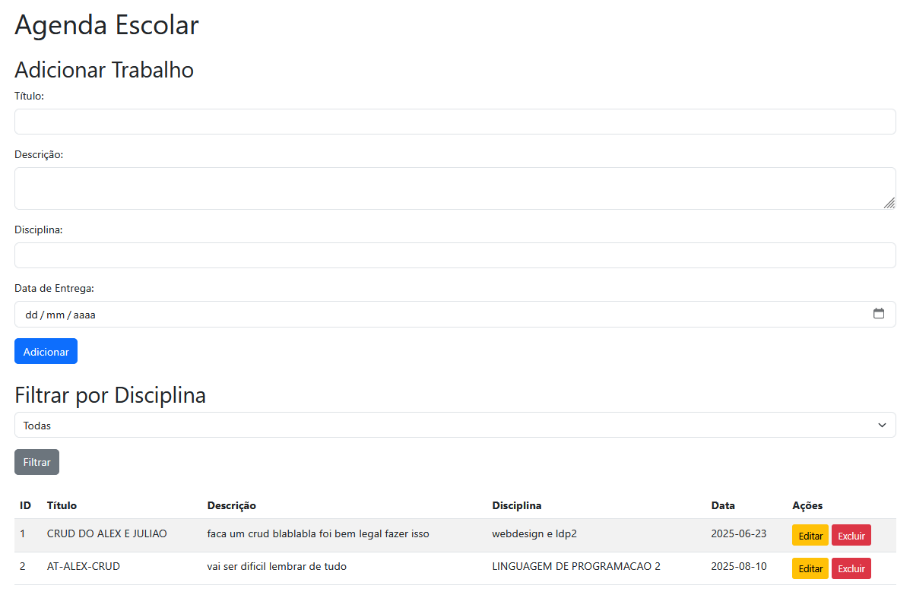

# 📚 Agenda Escolar - CRUD com Node.js e Bootstrap 5

Este é um projeto web simples que permite adicionar, editar, excluir e filtrar trabalhos escolares. Ele utiliza **Node.js** (com **Express.js**) no backend e **Bootstrap 5** no frontend para o layout.

---

## ✅ Funcionalidades

- Adicionar trabalhos escolares
- Editar trabalhos existentes
- Excluir trabalhos
- Filtrar trabalhos por disciplina
- Exibição de lista com ID, Título, Descrição, Disciplina e Data de Entrega

---

## 💻 Screenshot



---

## 🚀 Como executar localmente

### Pré-requisitos:
- Node.js instalado na sua máquina (versão 14.x ou superior)

### Passos:

1. Clone o repositório:

```bash
git clone https://github.com/seu-usuario/seu-repositorio.git
```

2. Acesse a pasta do projeto:

```bash
cd nome-da-pasta-do-projeto
```

3. Instale as dependências:

```bash
npm install
```

4. Inicie o servidor:

```bash
node server.js
```

5. Abra no navegador:

```
http://localhost:3000
```

---

## 🛠️ Tecnologias utilizadas

- Node.js
- Express.js
- Bootstrap 5
- HTML / CSS / JavaScript

---

## 📄 Licença

Este projeto está sob a licença MIT.

---

## ✨ Autor

Feito com 💙 por João Fiedler
